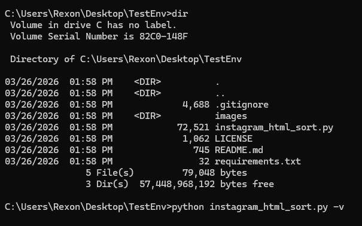
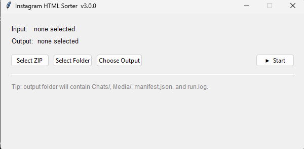

> Built for handling messy Instagram exports at scale.
# Instagram HTML Sorter

Advanced Instagram export parser with chat merging, media deduplication, and an interactive offline chat viewer.

---

## ✨ Features

- 🔗 Multi-part chat reconstruction
- 🧠 Message + media deduplication (SHA-256)
- 📂 Organized output structure
- 🖼️ Offline chat viewer (HTML)
- ⚡ Fast & resumable processing

---

## 📸 How to Use

### 1. Run the script


### 2. Open menu


### 3. Select input folder


### 4. Select output folder


### 5. Start processing


---

## 🖥️ Viewer Preview


---

## ⚙️ Usage

```bash
python instagram_html_sort.py --input <path> --output <path>
```

---

## 📦 Install Dependencies

```bash
pip install -r requirements.txt
```

---

## 📁 Output Structure

```
Chats/
Media/
manifest.json
```

---

## 📝 License

Licensed under the MIT License.