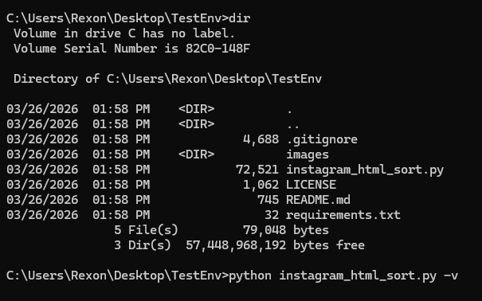
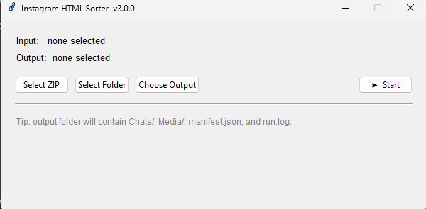
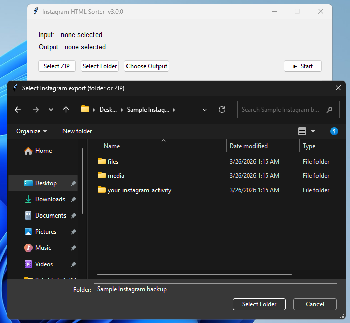
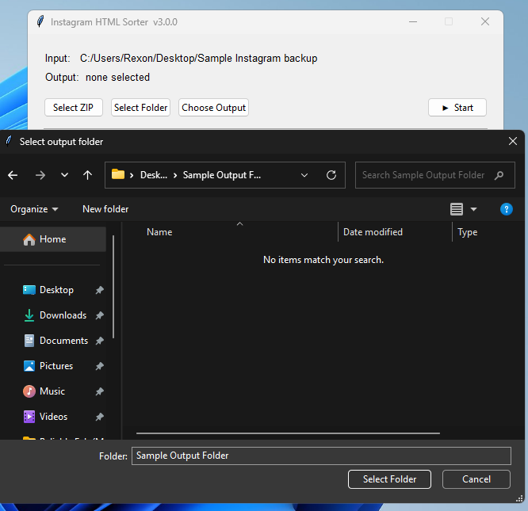
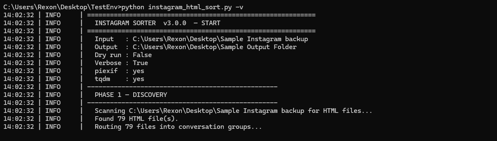

> Built for handling messy Instagram exports at scale.

# Instagram HTML Sorter

A Python-based Instagram export parser and archive generator for reconstructing conversations, deduplicating media, organizing exported data, and generating an interactive offline chat viewer.

Built after dealing with the reality of large, messy Instagram exports.

## Features

* **Multi-part chat reconstruction** — Combines split conversation files into complete chat histories.
* **Message & media deduplication** — Uses SHA-256 hashing to detect and eliminate duplicate media.
* **Structured output** — Organizes chats, media, and generated data into a predictable directory structure.
* **Offline chat viewer** — Generates a standalone HTML interface for browsing reconstructed conversations without an internet connection.
* **Fast & resumable processing** — Designed to handle larger exports without unnecessarily repeating completed work.

---

##Performance & Data Handling
* **True Media Deduplication:** Meta's export tool generates a differently named file every single time an image is sent. By using SHA-256 hashing, the engine ignores filenames and compares the actual data payload. This prevents gigabytes of duplicate media from bloating the final archive, all without modifying or deleting your original raw export.
* **Hardware-Agnostic Speed:** Highly optimized for low-end hardware. It can parse and reconstruct 79 complete chat histories in under 2 minutes on a dual-core Intel Celeron. On modern CPUs, it tears through massive exports in seconds.
* **Adaptable Parsing:** Meta frequently changes their HTML export structures. The parsing logic is deliberately modular, making it trivial to tweak and adapt to new export formats as they evolve.

---
## How It Works

```text
Instagram Export
       │
       ▼
 Parse HTML files
       │
       ├──► Reconstruct conversations
       │
       ├──► Process media
       │
       └──► Detect duplicates
                │
                ▼
         Generate archive
                │
        ┌───────┴────────┐
        ▼                ▼
      Chats/           Media/
        │
        └──────► Offline HTML Viewer
```

## How to Use

### 1. Run the script



### 2. Open the menu



### 3. Select the input folder



### 4. Select the output folder



### 5. Start processing



## Usage

```bash
python instagram_html_sort.py --input <path> --output <path>
```

## Installation

Install the required dependencies:

```bash
pip install -r requirements.txt
```

## Output

The processed archive is organized roughly like this:

```text
output/
├── Chats/
├── Media/
└── manifest.json
```

## Why I Built It

Instagram exports are not always particularly convenient to work with. Conversations can be split across multiple files, media can appear more than once, and browsing the raw export isn't exactly pleasant.

This project started as an attempt to turn that messy export into something **organized, deduplicated, searchable, and usable offline**.

## Project Status

Actively developed as a personal data-processing and automation project.

## License

Licensed under the MIT License.

---

`REXON // build tools for problems that shouldn't be annoying.`
